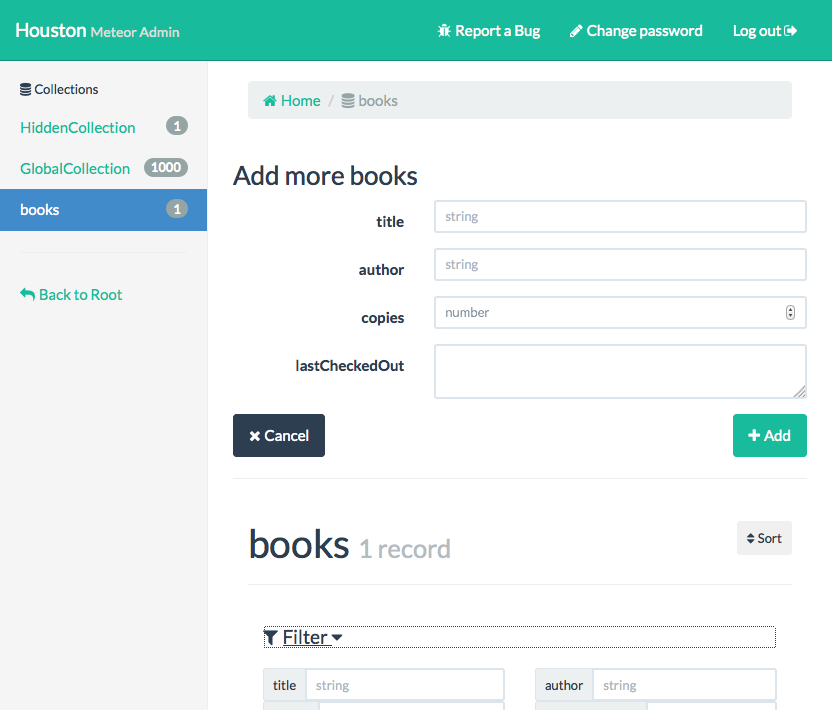
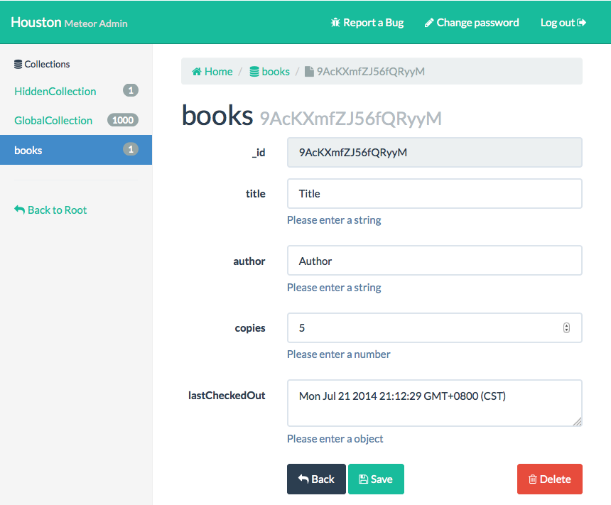
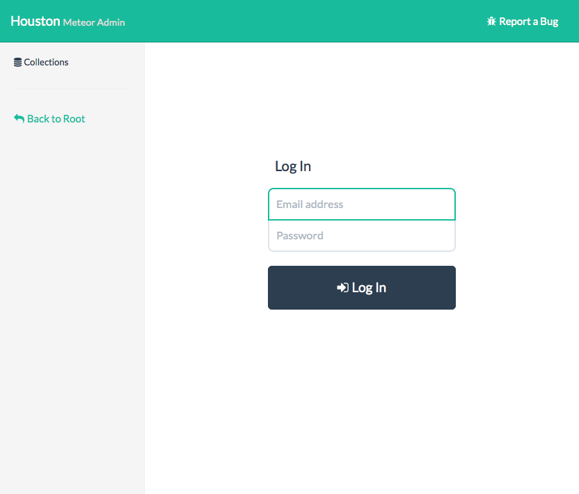

Houston
===============
Houston (formerly Z-Mongo-Admin) is a zero-config Meteor Admin, modeled after [Django Admin](https://docs.djangoproject.com/en/dev/ref/contrib/admin/). Houston is available through the [Atmosphere](https://atmosphere.meteor.com/package/houston) package manager.

### Getting Started
```
mrt add houston
```

Once installed, navigate to `/admin` to set up your admin account. You can either create a new user to act as Houston's Admin, or upgrade an existing user into an admin by going to /admin with a logged in user.  

### Demo

TODO update
* [Dinners](http://interndinners.meteor.com/dinners)
* [Dinners Admin](http://interndinners.meteor.com/admin)


### Why Houston?
* It's nice to give a client (or end-user) an admin UI without too much additional work
* Often, in development it's nice to pop in and explore or update your data without dealing with a mongo shell.

Features
========

#### /admin: Get a list of available collections


#### /admin/collection: View all items in collection


Collection view includes support for 
- deleting and creating documents
- inline editing (double-click on a cell)
- filtering and sorting by names
- arbitrary mongo filters (see the last filter), so long as you're comfortable with Mongo.
- support for nested objects
- (limited, mostly read-only) support for arrays

#### /admin/collection/document_id: Edit a particular document


#### /admin/login: User-defined Admin based on Meteor Accounts


Dependencies
-----

* **Router**: As of v1.0, Houston is compatible with both IronRouter and Router-less solutions that don't conflict with IronRouter. [Let us know](https://github.com/gterrono/houston/issues/new)
* **Accounts**: Houston piggybacks on top of Meteor Accounts.  
* **CSS**: Houston uses Bootstrap, but makes an effort to avoid having its CSS interfere with yours.
* **Meteor**: TODO figure out minimum version, or set arbitrarily high bar.

Feature Wishlist
-------
- custom admin roles: let package users write their own allow/deny scripts for admin types
- Allow package user to add custom CSS or functionality buttons per collection / per view
- full support for Arrays / all sorts of complicated nested documents
- Log of all actions done on Houston and (though this is tough) ability to roll back actions.

History
-------
Houston was originally created during the [Summer 2013 Meteor Hackathon](http://www.meteor.com/blog/2013/07/09/congratulations-to-the-meteor-summer-hackathon-2013-teams) by @gterrono, @alexeymk, @yefim and @ceasar.
